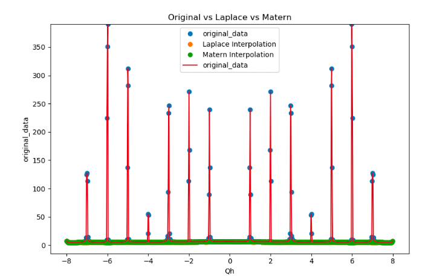
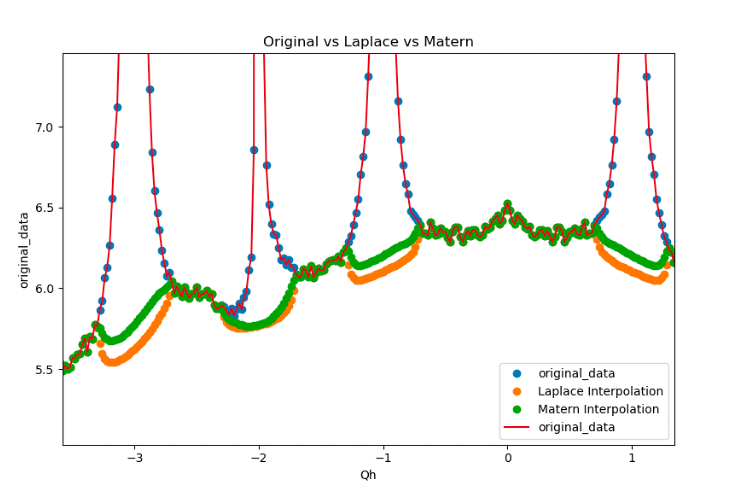

# Fast Interpolation for Volume Datasets
This code performs Laplace and Matern interpolation where missing data are on a one, two, or three
dimensional grid. Matern
kernels generalize the radial basis function approach to interpolation, but
interpolation using these kernels 
involves systems of equations that are dense. By using the Green's function
representation, and substituting the finite-difference operator, we replace the dense operator with a sparse one
and thus obtain an approximation to the kernel.

# Installation

This package is unregistered, so please install using

```<julia-repl>
pkg> add https://bitbucket.org/vishwasrao/LaplaceInterpolation.jl
```

# Notebooks
Jupyter Notebooks which illustrate the speed and accuracy of the approximation
are located in the `/Notebooks` directory.

To run the examples yourself, clone the repo, navigate to the Notebooks
directory, start julia and use
```
julia> include("run_notebooks()") 
```
which will start a jupyter notebook for you, with all relevant dependencies.

# Documentation and Tests
Forthcoming.

# Sample results
Below are plots that demonstrate the efficacy of the interpolation schemes. We
use a punch and fill algorithms to smoothen the Bragg peaks.  We plot a one
dimensional slice of the 3D data (for a fixed value of Y and Z axes). The image
on the left shows the data with and without interpolation (Red color shows the
original data, Green and Orange respectively show Laplace and Matern
interpolated data). We zoom in at certain location to examine the accuracy of
the interpolation schemes (the right image).


Bragg Peaks                | Matern and Laplace Interpolation 
:-------------------------:|:--------------------------------:
  |  

# Similar Packages
```Laplacians.jl``` authored by Dan Spielman

# Funding
This material is based upon work supported by the U.S. Department of Energy,
Office of Science, Office of Basic Energy Sciences.

