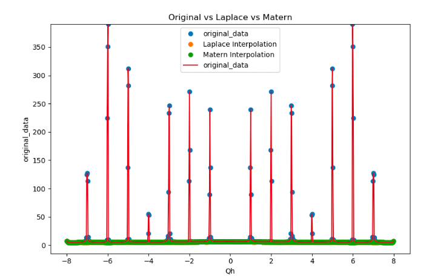
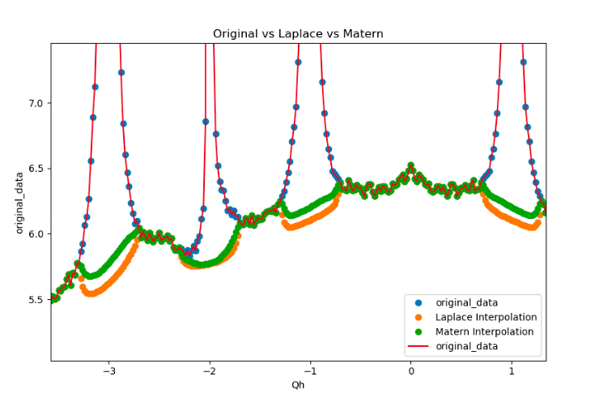

# Laplace and Matern Interpolation for Volume Datasets
This code performs Laplace and Matern interpolation for volume datasets. The code is especially useful for studying crystal structures which contain Bragg peaks.  ```MaternKernelApproximation.jl``` takes in the volume data and uses a punch and fill algorithm to remove the Bragg peaks and interpolates for missing values at punch locations. We provide two options for interpolation: Laplace interpolation and Matern Interpolation. 

# Dependencies
```MaternKernelApproximation.jl``` itself requires only ```LinearAlgebra``` and ```SparseArrays``` packages. A Jupyter notebook that illustrates the use of ```MaternKernelApproximation.jl``` can be found at ```Notebooks/MaternInterpolationWorkflow.ipynb```. The jupyter notebook illustrates the usage for smoothing out Bragg peaks in Molybdenum Vanadium Dioxide dataset. 

# Sample results
Below are plots that demonstrate the efficacy of the interpolation schemes. We use a punch and fill algorithms to smoothen the Bragg peaks.
We plot a one dimensional slice of the 3D data (for a fixed value of Y and Z axes). The image on the left shows the data with and without interpolation (Red color shows the original data, Green and Orange respectively show Laplace and Matern interpolated data). We zoom in at certain location to examine the accuracy of the interpolation schemes (the right image).


Bragg Peaks                | Matern and Laplace Interpolation 
:-------------------------:|:--------------------------------:
  |  

# Funding
This project is funded by the US DOE under the BES program.